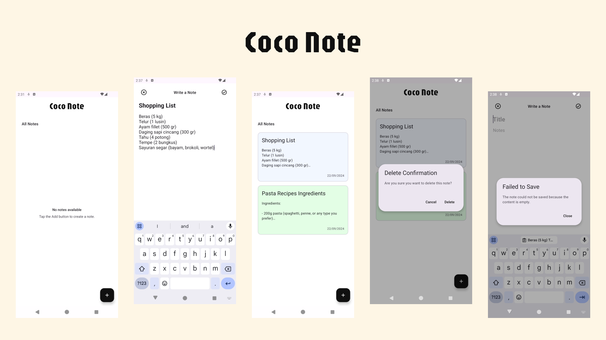

# Coco Note - is a simple, user-friendly note-taking application.

## Screenshots

Coco Note is a simple, user-friendly note-taking application that allows users to add, update, delete, and view notes. This app leverages local storage to ensure users' notes are saved persistently, even after closing the app.

## Features

1. **Home (Display List of Notes)**
    - Users can view a list of all saved notes.
    - Users can create a new note by tapping the Add button.
    - Users can open and edit a note by selecting it from the list.
    - Users can delete a note by long-pressing on it.
   
2. **Write Note**
    - Users can write a title and the content of the note.
    - Users can save the note by tapping the Check icon in the top-right corner.
    - Users can go back to the home screen using the Close icon or the system's back navigation. Notes are also saved when navigating back.

## Tech Stack

**Architecture**
   - MVVM (Model-View-ViewModel) architecture is used to separate concerns and ensure maintainability and testability of the app.

**Layers**
   - UI Layer: Handles all user interface elements and navigation. 
   - Domain Layer: Manages business logic. 
   - Data Layer: Manages local data, using Room for storage.

## Libraries and Tools

- **Room (SQLite)**: Used for local storage of notes.
- **Hilt**: Dependency Injection framework for easier management of dependencies.
- **Navigation Component**: Simplifies navigation and ensures consistent transitions between screens.

## Getting Started

**Prerequisites**
- Android Studio (latest stable version recommended)
- Minimum Android SDK version 26

## Installation Steps
1. Clone this repository: 
2. Open the project in Android Studio.
3. Sync the project with Gradle. 
4. Run the app on an emulator or physical device.